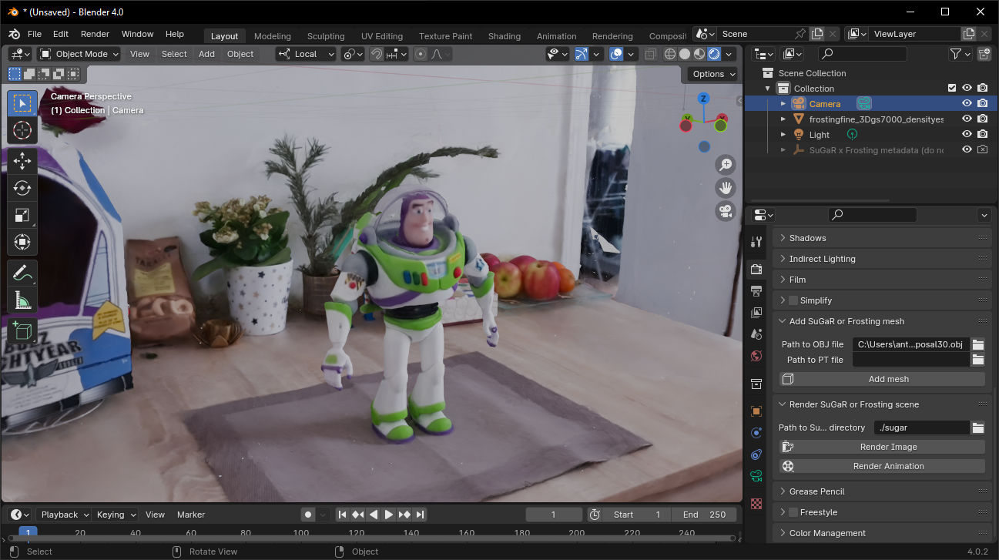
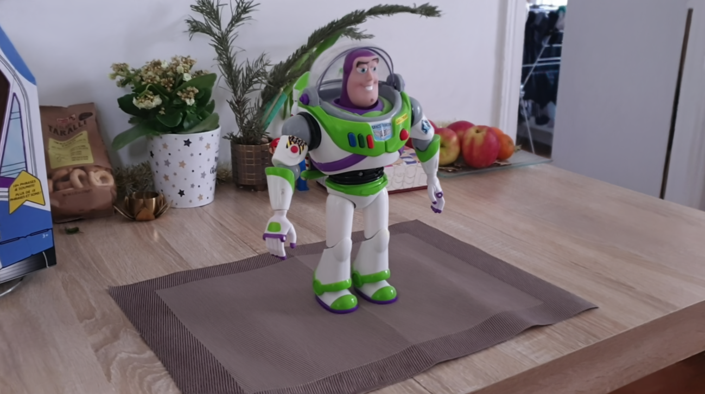

<div align="center">

# Gaussian Frosting: Editable Complex Radiance Fields <br>with Real-Time Rendering

<font size="4">
ECCV 2024 - ORAL
</font>
<br>

<font size="4">
<a href="https://anttwo.github.io/" style="font-size:100%;">Antoine Guédon</a>&emsp;
<a href="https://vincentlepetit.github.io/" style="font-size:100%;">Vincent Lepetit</a>&emsp;
</font>
<br>

<font size="4">
LIGM, Ecole des Ponts, Univ Gustave Eiffel, CNRS
</font>

| <a href="https://anttwo.github.io/frosting/">Webpage</a> | <a href="https://arxiv.org/abs/2403.14554">arXiv</a> | <a href="https://github.com/Anttwo/sugar_frosting_blender_addon/">Blender add-on</a> | <a href="https://www.youtube.com/watch?v=h7LeWq8sG78">Presentation video</a> |

 <br>
<b>Our method extracts a mesh from RGB images and builds an adaptive layer of 3D Gaussians around the mesh to better capture the fine details and volumetric effects near the surface, such as hair or grass.<br>
Our representation allows for efficient and realistic rendering using Gaussian splatting, as well as editing, composition and animation by modifying the base meshes with our <a href="https://github.com/Anttwo/sugar_frosting_blender_addon/">Blender add-on</a>.</b>
</div>

## Abstract

_We propose Gaussian Frosting, a novel mesh-based representation for high-quality rendering and editing of complex 3D effects in real-time. Our approach builds on the recent <a href="https://repo-sam.inria.fr/fungraph/3d-gaussian-splatting/">3D Gaussian Splatting</a> framework, which optimizes a set of 3D Gaussians to approximate a radiance field from images. We propose first extracting a base mesh from Gaussians during optimization, then building and refining an adaptive layer of Gaussians with a variable thickness around the mesh to better capture the fine details and volumetric effects near the surface, such as hair or grass. We call this layer Gaussian Frosting, as it resembles a coating of frosting on a cake. The fuzzier the material, the thicker the frosting. We also introduce a parameterization of the Gaussians to enforce them to stay inside the frosting layer and automatically adjust their parameters when deforming, rescaling, editing or animating the mesh. Our representation allows for efficient rendering using Gaussian splatting, as well as editing and animation by modifying the base mesh. 
Additionally, the mesh can be used for occlusion culling on Gaussians, accelerating rendering during both optimization and inference.
We demonstrate the effectiveness of our method on various synthetic and real scenes, and show that it outperforms existing surface-based approaches. We released the code a well as a dedicated <a href="https://github.com/Anttwo/sugar_frosting_blender_addon/">Blender add-on</a> as additional contributions._


## BibTeX

```
@article{guedon2024frosting,
 title={Gaussian Frosting: Editable Complex Radiance Fields with Real-Time Rendering},
 author={Gu{\'e}don, Antoine and Lepetit, Vincent},
 journal={ECCV},
 year={2024}
}
```

## Updates and To-do list

<details>
<summary><span style="font-weight: bold;">Updates</span></summary>
<ul>
  <li><b>[09/20/2024]</b> Code release.</li>
</ul>
</details><br>

<details>
<summary><span style="font-weight: bold;">To-do list</span></summary>
<ul>
  <li><b>gsplat support:</b> Make the code compatible with gsplat's rasterizer from the Nerfstudio team. A wrapper is already available in `./gsplat_wrapper`.</li>
  <li><b>Depth or normal regularization:</b> Add depth/normal regularization relying on pretrained models (DepthAnythingV2, for example).</li>
</ul>
</details>

## Overview

The full Gaussian Frosting pipeline consists of 5 main steps, and an optional one:
1. **Short vanilla 3DGS optimization**: Optimizing a 3D Gaussian Splatting model for 7k iterations, in order to let Gaussians position themselves in the scene.
2. **Surface regularization**: Optimizing Gaussians alignment with the surface of the scene.
3. **Mesh extraction**: Extracting a mesh from the optimized Gaussians, that will be used as a base for the Frosting layer.
4. **Frosting layer initialization**: Initializing a layer of Gaussians around the mesh, which an adaptive thickness that depends on the local fuzziness of the material. More specifically, the thickness of the Frosting layer is computed by quantifying how much the Gaussians struggle to align on a surface.
5. **Frosting layer optimization**: Optimizing the Frosting layer to better capture the fine details and volumetric effects near the surface. The user is free to choose the number of Gaussians to sample in the Frosting layer depending on the performance of the GPU; The Frosting layer will automatically allocate more Gaussians in regions with more details. We also propose an optional *Occlusion Culling* strategy that speeds up the frosting layer optimization and rendering by skipping Gaussians occluded by the mesh, but it slightly impacts the quality of the rendering.
6. **Textured mesh extraction (Optional)**: Extracting a traditional textured mesh from the Frosting layer as a tool for visualization, editing, composition or animation in Blender using our <a href="https://github.com/Anttwo/sugar_frosting_blender_addon/">Blender add-on</a>.

We provide a dedicated script for each of these steps, as well as a script `train_full_pipeline.py` that runs the entire pipeline. We explain how to use this script in the next sections. <br>

Please note that the final step, _Textured mesh extraction_, is optional but is enabled by default in the `train_full_pipeline.py` script. Indeed, it is very convenient to have a traditional textured mesh for visualization, composition and animation using traditional softwares such as <a href="https://github.com/Anttwo/sugar_frosting_blender_addon/">Blender</a>. If you installed Nvdiffrast as described below, this step should only take a few seconds anyway.

<div align="center">


<br><b>You can visualize, edit, combine or animate the reconstructed textured meshes in Blender <i>(left)</i> <br>and render the result with Gaussian Frosting <i>(right)</i> thanks to our <a href="https://github.com/Anttwo/sugar_frosting_blender_addon/">Blender add-on</a>.</b><br>
</div><br>

## Installation

<details>
<summary><span style="font-weight: bold;">Click here to see content.</span></summary>

### 0. Requirements

The software requirements are the following:
- Conda (recommended for easy setup)
- C++ Compiler for PyTorch extensions
- CUDA toolkit 11.8 for PyTorch extensions
- C++ Compiler and CUDA SDK must be compatible

Please refer to the original <a href="https://github.com/graphdeco-inria/gaussian-splatting">3D Gaussian Splatting repository</a> for more details about requirements.

### 1. Clone the repository

Start by cloning this repository:

```shell
# HTTPS
git clone https://github.com/Anttwo/Frosting.git --recursive
```

or

```shell
# SSH
git clone git@github.com:Anttwo/Frosting.git --recursive
```

### 2. Creating the Conda environment

To create and activate the Conda environment with all the required packages, go inside the `Frosting/` directory and run the following command:

```shell
python install.py
conda activate frosting
```

This script will automatically create a Conda environment named `frosting` and install all the required packages. It will also automatically install the <a href="https://github.com/graphdeco-inria/gaussian-splatting">3D Gaussian Splatting</a> rasterizer as well as the <a href="https://nvlabs.github.io/nvdiffrast/">Nvdiffrast</a> library for faster mesh rasterization and occlusion culling.

If you encounter any issues with the installation, you can try to follow the detailed instructions below to install the required packages manually.

<details>
<summary><span style="font-weight: bold;">
Detailed instructions for manual installation
</span></summary>

#### a) Install the required Python packages
To install the required Python packages and activate the environment, go inside the `Frosting/` directory and run the following commands:

```shell
conda env create -f environment.yml
conda activate frosting
```

If this command fails to create a working environment, you can try to install the required packages manually by running the following commands:
```shell
conda create --name frosting -y python=3.9
conda activate frosting
conda install pytorch==2.0.1 torchvision==0.15.2 torchaudio==2.0.2 pytorch-cuda=11.8 -c pytorch -c nvidia
conda install -c fvcore -c iopath -c conda-forge fvcore iopath
conda install pytorch3d==0.7.4 -c pytorch3d
conda install -c plotly plotly
conda install -c conda-forge rich
conda install -c conda-forge plyfile==0.8.1
conda install -c conda-forge jupyterlab
conda install -c conda-forge nodejs
conda install -c conda-forge ipywidgets
pip install open3d
pip install --upgrade PyMCubes
```

#### b) Install the Gaussian Splatting rasterizer

Run the following commands inside the `Frosting` directory to install the additional Python submodules required for Gaussian Splatting:

```shell
cd gaussian_splatting/submodules/diff-gaussian-rasterization/
pip install -e .
cd ../simple-knn/
pip install -e .
cd ../../../
```
Please refer to the <a href="https://github.com/graphdeco-inria/gaussian-splatting">3D Gaussian Splatting repository</a> for more details.

#### c) (Optional) Install Nvdiffrast for faster Mesh Rasterization and Occlusion Culling

We propose an optional occlusion culling method, relying on mesh rasterization with the <a href="https://nvlabs.github.io/nvdiffrast/">Nvdiffrast</a> library.
Occlusion culling speeds up optimization and rendering by removing Gaussians that are occluded by the mesh, but slightly impacts the quality of the rendering.
If you want to use occlusion culling for optimization or rendering, you can install the Nvdiffrast library by running the following commands.<br> 
Please note that installing Nvdiffrast will also greatly speed up the textured mesh extraction step, from a few minutes to less than 10 seconds.

```shell
git clone https://github.com/NVlabs/nvdiffrast
cd nvdiffrast
pip install .
cd ../
```

</details>

</details>

## Quick Start

<details>
<summary><span style="font-weight: bold;">Click here to see content.</span></summary>

### Training from scratch

You can run the following single script to optimize a full Gaussian Frosting model from scratch using a COLMAP dataset:

```shell
python train_full_pipeline.py -s <path to COLMAP dataset> --gaussians_in_frosting 2_000_000 -r <"dn_consistency", "density" or "sdf"> --use_occlusion_culling False --export_obj True
```

You can choose the number of Gaussians to use in the Frosting layer with the `--gaussians_in_frosting` argument, depending on the complexity of the scene or the performance of your GPU. Using `2_000_000` Gaussians is a good trade-off for most scenes, but you can try with `5_000_000` Gaussians for optimal quality.

You can also choose the regularization method with the `-r` argument, which can be `"dn_consistency"`, `"density"` or `"sdf"`. We recommend using the newer `"dn_consistency"` regularization for best quality meshes, but the results presented in the paper were obtained with the `"density"` regularization for object-centered scenes and `"sdf"` for scenes with a challenging background, such as the Mip-NeRF 360 dataset.

You can activate occlusion culling with the `--use_occlusion_culling True` argument, as it decreases optimization time and memory usage but has a small impact on the quality of the rendering. We recommend trying without occlusion culling first.

Finally, you can choose to export a traditional textured mesh with the `--export_obj` argument. This step is optional but is enabled by default in the `train_full_pipeline.py` script, as the mesh is required for using the <a href="https://github.com/Anttwo/sugar_frosting_blender_addon/">Blender add-on</a> and editing, combining or animating scenes in Blender.

<details>
<summary><span style="font-weight: bold;">Please click here to see the most important arguments for the `train_full_pipeline.py` script.</span></summary>

| Parameter | Type | Description |
| :-------: | :--: | :---------: |
| `--scene_path` / `-s`   | `str` | Path to the source directory containing a COLMAP dataset.|
| `--gs_output_dir` | `str` | Path to the checkpoint directory of a vanilla 3D Gaussian Splatting model. If no path is provided, the script will start from scratch and first optimize a vanilla 3DGS model. |
| `--eval` | `bool` | If True, performs an evaluation split of the training images. Default is `False`. |
| `--regularization_type` / `-r` | `str` | Type of regularization to use for optimizing a Frosting. Can be `"dn_consistency"`, `"density"` or `"sdf"`. We recommend using the newer `"dn_consistency"` regularization for best quality meshes. |
| `--gaussians_in_frosting` | `int` | Number of Gaussians to use in the Frosting layer. Default is `2_000_000`. You can try with `5_000_000` Gaussians for optimal quality. |
| `--use_occlusion_culling` | `bool` | If True, uses occlusion culling for accelerating optimization and rendering. Sligthly impacts the quality of the rendering. Default is `False`. |
|`--poisson_depth` | `int` | Depth of the Poisson reconstruction for the mesh extraction. If `-1`, the depth is automatically computed using our heuristic described in the paper. Default is `-1`. You can try to reduce the depth if your mesh has holes or too many ellipsoidal bumps. |
| `--cleaning_quantile` | `float` | Quantile used for cleaning the mesh after Poisson reconstruction. Default is `0.1`. We recommend `0.1` for real scenes and `0.0` for single-object synthetic scenes. |
| `--connected_components_vis_th` | `int` | Threshold to use for removing non-visible connected components in the mesh. We recommend using `0.001` for real scenes and `0.5` for single-object synthetic scenes. Default is `0.001`. |
| `--low_poly` | `bool` | If True, uses the standard config for a low poly mesh, with `200_000` vertices. |
| `--high_poly` | `bool` | If True, uses the standard config for a high poly mesh, with `1_000_000` vertices. |
| `--refinement_time` | `str` | Default configs for time to spend on refinement. Can be `"short"` (2k iterations), `"medium"` (7k iterations) or `"long"` (15k iterations). |
| `--export_ply` | `bool` | If True, export a `.ply` file with the refined Frosting 3D Gaussians at the end of the training. This file can be large (+/- 500MB), but is needed for using a 3DGS viewer. Default is `True`. |
| `--export_obj` | `bool` | If True, will optimize and export a traditional textured mesh as an `.obj` file from the Frosting model. Computing a traditional color UV texture should just take a few seconds with Nvdiffrast. Default is `True`. |
| `--texture_square_size` | `int` | Size of the square allocated to each pair of triangles in the UV texture. Increase for higher texture resolution. Please decrease if you encounter memory issues. Default is `8`. |
|`--white_background` | `bool` | If True, the background of the images will be set to white. Default is `False`. |

</details>
<br>

The default configuration is `high_poly` with `refinement_time` set to `"long"`. Results are saved in the `output/` directory.<br>

After mesh extraction, the refinement time only takes a few minutes when using `--refinement_time "short"`, but can take up to 30 minutes when using `--refinement_time "long"`. A short refinement time may be enough to produce a good-looking representation in most cases, but we recommend using a long refinement time for optimal quality.

Please note that the optimization time may vary depending on the complexity of the scene and the GPU used. Moreover, the current implementation splits the optimization into modular scripts that can be run separately so it reloads the data at each part, which is not optimal and takes several minutes.

Please see the `train_full_pipeline.py` for more details on all the command line arguments.

### Training from a vanilla Gaussian Splatting model

If you have already trained a <a href="https://github.com/graphdeco-inria/gaussian-splatting">vanilla Gaussian Splatting model</a> for a scene (we recommend training it for 7k iterations), you can use the `--gs_output_dir` argument to provide the path to the output directory of the vanilla Gaussian Splatting model. This will skip the first part of the optimization and directly load the Gaussians from the vanilla model:

```shell
python train_full_pipeline.py -s <path to COLMAP dataset> --gaussians_in_frosting 2_000_000 -r <"dn_consistency", "density" or "sdf"> --use_occlusion_culling False --export_obj True --gs_output_dir <path to the output directory of the vanilla 3DGS>
```

</details>


## Visualize the Frosting layer in real-time

<details>
<summary><span style="font-weight: bold;">Click here to see content.</span></summary><br>

After optimizing a Frosting model, you can visualize the Frosting layer in real-time using the 3D Gaussian Splatting viewer of your choice. <br>
Indeed, after optimization, we automatically export a `.ply` file in the `./output/refined_frosting_ply/` directory, containing the refined 3D Gaussians in the Frosting layer and compatible with any 3DGS viewer.
For instance, you can use the viewer provided in the original implementation of <a href="https://github.com/graphdeco-inria/gaussian-splatting">3D Gaussian Splatting</a>, or the awesome <a href="https://github.com/playcanvas/supersplat">SuperSplat viewer</a>. <br>
An online, <a href="https://playcanvas.com/supersplat/editor">in-browser version of SuperSplat</a> is also available.

We also recommend using our <a href="https://github.com/Anttwo/sugar_frosting_blender_addon/">Blender add-on</a> to create animations and video clips of Frosting representations. 
More specifically, the add-on allows you to import Frosting meshes and visualize, edit, combine or animate them in Blender.
Finally, you can render the result using Gaussian Frosting, which provides high-quality and realistic rendering of the Frosting layer.

</details>


## Rendering, composition and animation with Blender

<details>
<summary><span style="font-weight: bold;">Click here to see content.</span></summary><br>

The `visualize_results.ipynb` notebook and the `metrics.py` script provides examples of how to load a Frosting model for rendering a scene.

We also provide a <a href="https://github.com/Anttwo/sugar_frosting_blender_addon/">Blender add-on</a> for editing, combining, and animating Frosting meshes within Blender and render the result using the Gaussian Frosting representations. Meshes are located in the `./output/refined_frosting_base_mesh/` directory.

Please refer to the Blender add-on repository for more details on how to use the add-on and create a rendering package for Frosting.
After preparing the rendering package with Blender, which should be a `.JSON` file located in the `./output/blender/package/` directory, you can render the scene using the `render_blender_scene.py` script:

```shell
python render_blender_scene.py -p <Path to the rendering package>
```

The rendered images will be saved in the `./output/blender/renders/` directory.<br>
You can add the argument `--occlusion_culling True` to activate occlusion culling during rendering, which will speed up the rendering process by skipping Gaussians occluded by the mesh. However, you should use this option only if you optimized the Frosting models with occlusion culling enabled. Please note that occlusion culling may produce some small flickering artifacts in the rendered images (especially in the background).

Feel free to adjust the arguments of the script to adjust the rendering quality if you observe artifacts in the images.
Specifically, you can switch to `--adaptation_method simple` or reduce `deformation_threshold` to mitigate artifacts in the rendering.
Please refer to the script for more details on the command line arguments.

</details>

## Evaluation

<details>
<summary><span style="font-weight: bold;">Click here to see content.</span></summary><br>

To evaluate the quality of the reconstructions, we provide a script `metrics.py` that computes the PSNR, SSIM and LPIPS metrics on test images. Start by optimizing Frosting models for the desired scenes and a regularization method (`"dn_consistency"`, `"density"` or `"sdf"`), then create a `.json` config file containing the paths to the scenes in the following format: `{source_images_dir_path: corresponding_vanilla_gaussian_splatting_checkpoint_path}`.

Please take a look at the sample config files in the `./configs/` directory for more details.

Finally, run the script as follows:

```shell
python metrics.py --scenes_config <Path to the .json config file>
```

Results are saved in a `.json` file in the `output/metrics/` directory. 
Please refer to the script for more details on the command line arguments.

</details>


## Tips for using Gaussian Frosting on your own data and obtain better reconstructions

<details>
<summary><span style="font-weight: bold;">Click here to see content.</span></summary><br>

<details>
<summary><span style="font-weight: bold;">1. Capture images or videos that cover the entire surface of the scene</span></summary><br>

Using a smartphone or a camera, capture images or a video that cover the entire surface of the 3D scene you want to reconstruct. The easiest way to do this is to move around the scene while recording a video. Try to move slowly and smoothly in order to avoid motion blur. For consistent reconstruction and easier camera pose estimation with COLMAP, maintaining a uniform focal length and a constant exposure time is also important. We recommend to disable auto-focus on your smartphone to ensure that the focal length remains constant.

For better reconstructions, try to cover objects from several and different angles, especially for thin and detailed parts of the scene. 

To convert a video to images, you can install `ffmpeg` and run the following command:
```shell
ffmpeg -i <Path to the video file> -qscale:v 1 -qmin 1 -vf fps=<FPS> %04d.jpg
```
where `<FPS>` is the desired sampling rate of the video images. An FPS value of 1 corresponds to sampling one image per second. We recommend to adjust the sampling rate to the length of the video, so that the number of sampled images is between 100 and 300.

</details>

<details>
<summary><span style="font-weight: bold;">2. Estimate camera poses with COLMAP</span></summary><br>

Please first install a recent version of COLMAP (ideally CUDA-powered) and make sure to put the images you want to use in a directory `<location>/input`. Then, run the script `gaussian_splatting/convert.py` from the original Gaussian splatting implementation to compute the camera poses from the images using COLMAP. Please refer to the original <a href="https://github.com/graphdeco-inria/gaussian-splatting">3D Gaussian Splatting repository</a> for more details.

```shell
python gaussian_splatting/convert.py -s <location>
```

Sometimes COLMAP fails to reconstruct all images into the same model and hence produces multiple sub-models. The smaller sub-models generally contain only a few images. However, by default, the script `convert.py` will apply Image Undistortion only on the first sub-model, which may contain only a few images.

If this is the case, a simple solution is to keep only the largest sub-model and discard the others. To do this, open the source directory containing your input images, then open the sub-directory `<Source_directory>/distorted/sparse/`. You should see several sub-directories named `0/`, `1/`, etc., each containing a sub-model. Remove all sub-directories except the one containing the largest files, and rename it to `0/`. Then, run the script `convert.py` one more time but skip the matching process:

```shell
python gaussian_splatting/convert.py -s <location> --skip_matching
```

_Note: If the sub-models have common registered images, they could be merged into a single model as post-processing step using COLMAP; However, merging sub-models requires to run another global bundle adjustment after the merge, which can be time consuming._
</details>

<details>
<summary><span style="font-weight: bold;">3. DN-Consistency, Density or SDF? Choose a regularization method that fits your scene</span></summary><br>

**We recommend using the newer DN-Consistency regularization for best quality meshes**.

However, the results presented in the paper were obtained with the Density regularization for object-centered scenes and the SDF regularization for scenes with a challenging background, such as the Mip-NeRF 360 dataset.

As we explain in the original SuGaR paper, the density regularization is the simplest one and works well with objects centered in the scene. The SDF provides a stronger regularization, especially in background regions. 
As a consequence, the SDF regularization produces higher metrics on standard datasets. 
However, for reconstructing an object centered in the scene with images taken from all around the object, the simpler density regularization generally produces a better mesh than SDF.

The DN-Consistency regularization is a new regularization method that (a) enforces the Gaussians to align with the surface of the scene with the density regularization, while also (b) enforcing the consistency between the gradient of the depth and the normal maps, all rendered using the 3D Gaussians. <br>
As in SuGaR, the normal of a Gaussian is defined as the shortest axis of the covariance matrix of the Gaussian. <br> 
This regularization method provides the best quality meshes.

</details>

<details>
<summary><span style="font-weight: bold;">4. I have holes or ellipsoidal bumps in my mesh, what can I do?</span></summary><br>

If you have holes in your mesh, this means the cleaning step of the Poisson mesh is too aggressive for your scene. You can adjust the `cleaning_quantile` argument of the `train_full_pipeline.py` script to keep more vertices in the mesh. 
You can also try to adjust the `connected_components_vis_th` argument to remove non-visible connected components in the mesh. 
Finally, you can try to reduce the `poisson_depth` argument to reduce the number of vertices in the mesh as well as the number of ellipsoidal bumps.

</details>

<details>
<summary><span style="font-weight: bold;">5. (Optional) Adapt the scale and the bounding box of the scene</span></summary><br>

As it is explained in the original <a href="https://github.com/graphdeco-inria/gaussian-splatting">3D Gaussian Splatting repository</a>, the method is expected to reconstruct a scene with reasonable scale. For reconstructing much larger datasets, like a city district, the original authors recommend to lower the learning rates of the positions and scaling factors of the Gaussians. The more extensive the scene, the lower these values should be.

Concerning Frosting, such learning rates should also be lowered when reconstructing a very large scene. Moreover, as we explain in the supplementary material of the paper, for extracting a mesh from the Gaussians with an optimal repartition of vertices, we apply two Poisson reconstructions in practice: one on _foreground_ Gaussians, and one on _background_ Gaussians. The foreground Gaussians are defined as the Gaussians located inside a predefined bounding box, and the background Gaussians are defined as the Gaussians located outside this bounding box. 

By default, this bounding box is computed as the bounding box of all camera centers. This general approach is coherent with how the original 3D Gaussian Splatting scales the learning rates. We used this default bounding box for all the reconstructions shown in the paper and the presentation video.

However, this bounding box might not be optimal in very specific cases, especially when the user wants to reconstruct with high details a very specific object located somewhere in the scene, or if the scene is very large, or if the camera centers are very far from the scene.
The user is free to provide a custom bounding box to the `train.py` script, using the parameters `--bboxmin` and `--bboxmax`. Please note that the bounding box must be provided as strings, formatted as `"(x,y,z)"`, where `x`, `y` and `z` are the coordinates of the min and max points of the bounding box.

</details>

</details>